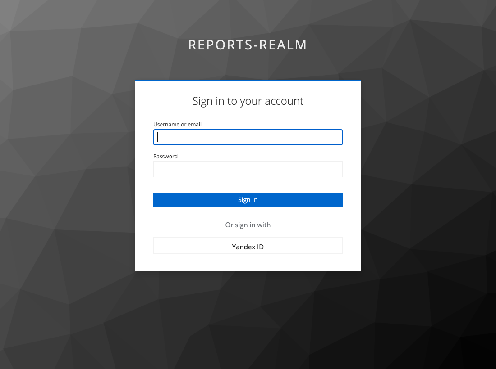

# Задача 1. Управление учётными данными пользователя

Диаграмма: [BionicPRO_C4_container.drawio](./BionicPRO_C4_container.drawio) (открывается в draw.io / diagrams.net).

## Что добавлено в C4-диаграмму контейнеров

| Компонент                                             | Роль                                                                                                                                                                     |
| ----------------------------------------------------- | ------------------------------------------------------------------------------------------------------------------------------------------------------------------------ |
| **Keycloak** (Authorization Server / Identity Broker) | Единая точка выпуска токенов BionicPRO, требует PKCE, брокерит внешние IdP разных стран, синхронизирует пользователей/роли из LDAP, MFA (OTP).                           |
| **bionicpro-auth** (BFF / Auth Gateway)               | Backend-for-Frontend: ведёт OAuth2 Code+PKCE с Keycloak, хранит access/refresh токены на сервере, отдаёт фронтенду только сессионную cookie, сам обновляет access_token. |
| **Session/Token Store** (Redis)                       | Зашифрованное хранение токенов, привязка к session id, ротация сессии.                                                                                                   |
| **Country Identity Provider** (внешний, вне контура)  | Удостоверяющие службы страны представительства: OpenLDAP-каталог офиса, Яндекс ID, ЕСИА и т.п.                                                                           |
| **reports-frontend** (React SPA)                      | Клиент; хранит только session cookie, токенов не видит.                                                                                                                  |

## Как решение закрывает три требования

1. **Унификация доступа через внешний источник в стране представительства без нарушения локального хранения ПДн/мед.данных.**
   Keycloak запрашивает данные учётной записи из внешнего каталога (LDAP/IdP), физически расположенного в стране представительства. Персональные и медицинские данные остаются в локальном источнике страны - BionicPRO их не реплицирует, а лишь получает claims для аутентификации/авторизации.

2. **Токены IdP не передаются фронтенду.**
   Весь обмен токенами ведёт `bionicpro-auth` (BFF). Access/refresh токены хранятся на сервере (Redis, шифрование), привязаны к сессии. Фронтенду возвращается только `HttpOnly + Secure` session cookie. Токены IdP не покидают серверный контур.

3. **Поддержка разных внешних удостоверяющих служб в разных странах.**
   Keycloak в роли Identity Broker федерирует несколько внешних IdP (по одному на страну/представительство). Добавление новой страны = новый brokered IdP + LDAP federation, без изменения фронтенда и бизнес-сервисов.

## Яндекс ID (Identity Brokering)

Через Identity Brokering подключён внешний провайдер `yandex` ([keycloak/realm-export.json](../keycloak/realm-export.json), секция `identityProviders`).

- `providerId: oidc`, эндпоинты Яндекс OAuth: `oauth.yandex.ru/authorize`, `oauth.yandex.ru/token`, профиль из `login.yandex.ru/info`.
- PKCE на брокере (`pkceEnabled: true`, `S256`).
- Согласие пользователя на использование данных: `prompt=consent` + экран проверки профиля на `first broker login` (`updateProfileFirstLoginMode: on`).
- Профиль из Яндекса переносится мапперами в учётную запись: `default_email -> email`, `first_name -> firstName`, `last_name -> lastName`, `login -> username`; вошедшему через Яндекс выдаётся роль `prothetic_user`.
- `clientId`/`clientSecret` в realm это заглушки, подставляются реальные значения из приложения Яндекс OAuth (`YANDEX_CLIENT_ID`, `YANDEX_CLIENT_SECRET`).

Кнопка входа через Яндекс на странице логина realm `reports-realm`:

